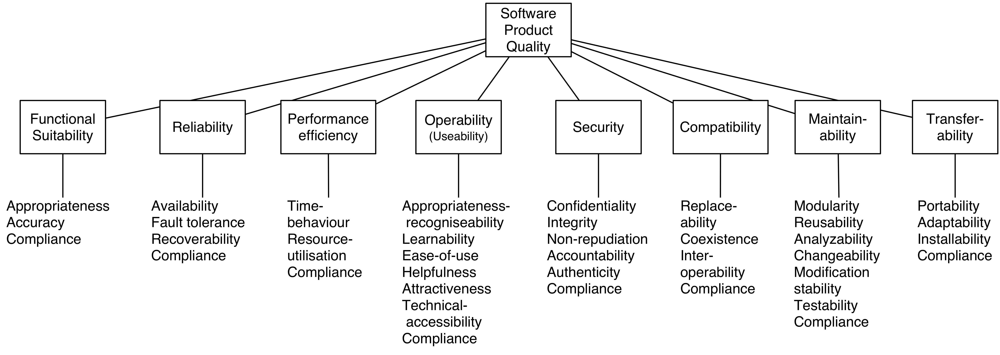

# Quality and Risk Management

Quality is and will always the number one aspects. This section provides various tools and templates for managing your business IT quality aspects.

## Tools for Architecture QA processes

* [Architecture checklists](#simple-architecture-checklist-questions).
* [Architecture Documentation Checklist](#architecture-documentation-checklist)
* [Use proven IT standards for requirements](#it-standards)
* [Non Functional Requirements (NFR list)](capabilities.html).
* [Overview of ISO 25010](#short-overview-of-iso-25010)

 
## Tools for a better IT Architecture 

An architecture checklist helps in the governance process. Architecture checklists can become long, complex and time consuming in usage. However the aim with this architecture checklist is that it will help you and all your stakeholders involved in a simple way when you are dealing with architecture quality and risk aspects.

This architecture checklist is composed out of some critical questions that all relate back to the main goal of doing architecture in the first place.

## Simple architecture checklist questions

* Is your main goal covered and reached with this architecture?
* Does the architecture address operability?
* Does the architecture address the following quality attributes:
    *    performance
    *    availability
    *    maintainability
    *    modifiability
    *    security
    *    privacy
    *    testability
    *    operability
    *    flexibility
*    Does the architecture address and use principles? E.g. business principles.
*    Can implementation risks easily be derived out of your architecture deliverables?
*    Are architecture reviews done in a structured way? Architecture reviews SHOULD be performed to increase quality, control costs and reduce risks.
*    Is it clear what assumptions are used for your architecture? (Take explicit and implicit assumptions into account!)

## Architecture Documentation Checklist

When creating business IT documentation (e.g. IT architectures/designs) following these rules will help for producing sound documentation:

*    Documentation should be written from the point of view of the reader, not the writer.
*    IT Documentation should be organized for ease of reference, not ease of reading. A document may be read from cover to cover at most once, and probably never. But a document is likely to be referenced hundreds or thousands of times.
*    Avoid repetition. Each kind of information should be recorded in exactly one place. This makes documentation easier to use and much easier to change as it evolves. It also avoids confusion.
*    Avoid unintentional ambiguity. In some sense, the point of architecture is to be ambiguous. However unplanned ambiguity is when documentation can be interpreted in more than one way, and at least one of those ways is incorrect. A well-defined notation with precise semantics goes a long way toward eliminating whole classes of linguistic ambiguity from a document. This is one area where architecture description languages help a great deal, but using a formal language isn’t always necessary.
*    Standardize your documentation. Use always the same templates for the same documents within your organization. Even better: Make use of de-facto standardizations that also make sense for people outside your organization, since you will be working with many people outside your organization during the life cycle of your product. A standard organization offers many benefits. It helps the reader navigate the document and find specific information quickly.
*    Record rationale. So document decisions made. Recording rationale will save you enormous time in the long run, although it requires discipline to record in the heat of the moment. It will prevent the same discussions over and over again and everyone knows why the chosen path is taken.
*    Keep it current. Documentation that is out of date, does not reflect truth, and does not obey its own rules for form and internal consistency will not be used. Documentation that is kept current and accurate will be used.
*    Review documentation for fitness of purpose. Only the intended users of a document will be able to tell if it contains the right information presented in right way.

## IT standards

**Requirement :** Business Process Models must be based on  BPMN 2.0

**Description :** A standard Business Process Model and Notation (BPMN) will provide businesses with the capability of understanding their internal business procedures in a graphical notation and will give organizations the ability to communicate these procedures in a standard manner. Furthermore, the graphical notation will facilitate the understanding of the performance collaborations and business transactions between the organizations. See: http://www.bpmn.org/

**Requirement :** Digital Signature Standard (DSS)         

**Description :** This Standard defines methods for digital signature generation that can be used for the protection of binary data (commonly called a message), and for the verification and validation of those digital signatures. Three techniques are approved.
1. The Digital Signature Algorithm (DSA) is specified in this Standard. The specification includes criteria for the generation of domain parameters, for the generation of public and private key pairs, and for the generation and verification of digital signatures.
2. The RSA digital signature algorithm is specified in American National Standard (ANS) X9.31 and Public Key Cryptography Standard (PKCS) #1. FIPS 186-4 approves the use of implementations of either or both of these standards and specifies additional requirements.
3. The Elliptic Curve Digital Signature Algorithm (ECDSA) is specified in ANS X9.62. FIPS 186-4 approves the use of ECDSA and specifies additional requirements. Recommended elliptic curves for Federal Government use are provided herein.
See: http://nvlpubs.nist.gov/nistpubs/FIPS/NIST.FIPS.186-4.pdf

**Requirement :** FIPS PUB 198-1:The Keyed-Hash Message Authentication Code (HMAC)      

**Description :** Providing a way to check the integrity of information transmitted over or stored in an unreliable medium is a prime necessity in the world of open computing and communications. Mechanisms that provide such integrity checks based on a secret key are usually called message authentication codes (MACs). Typically, message authentication codes are used between two parties that share a secret key in order to authenticate information transmitted between these parties. This Standard defines a MAC that uses a cryptographic hash function in conjunction with a secret key. This mechanism is called HMAC [HMAC]. HMAC shall use an Approved cryptographic hash function [FIPS180-3]. HMAC uses the secret key for the calculation and verification of the MACs. See:http://csrc.nist.gov/publications/fips/fips198-1/FIPS-198-1_final.pdf

**Requirement :** Implementation must comply to the 'Do Not Track Compliance Policy'   

**Description :** The website (DNS) is compliant with the privacy-friendly Do Not Track (DNT) Policy of the EFF.org organization. Reference: https://www.eff.org/dnt-policy W3C reference:http://www.w3.org/TR/tracking-dnt/

**Requirement :** JSON-LD           

**Description :** JSON-LD is a lightweight Linked Data format. It is easy for humans to read and write. It is based on the already successful JSON format and provides a way to help JSON data interoperate at Web-scale. JSON-LD is an ideal data format for programming environments, REST Web services, and unstructured databases such as CouchDB and MongoDB. See: http://json-ld.org/

**Requirement :**  Payment Card Industry (PCI)  DSS v3.1              

**Description :**  The design/implementation must be compliant with the Payment Card Industry (PCI) Data Security Standard version 3.1. PCI DSS provides a baseline of technical and operational requirements designed to protect account data. PCI DSS applies to all entities involved in payment card processing — including merchants, processors, acquirers, issuers, and service providers. PCI DSS also applies to all other entities that store, process or transmit cardholder data (CHD) and/or sensitive authentication data (SAD). Detailed spec on: https://www.pcisecuritystandards.org/documents/PCI_DSS_v3-1.pdf

**Requirement :** Secure Hash Standard (SHS)- FIPS PUB 180             

**Description :** This Standard specifies secure hash algorithms, SHA -1, SHA-224, SHA-256, SHA-384, SHA-512, SHA-512/224 and SHA-512/256. All of the algorithms are iterative, one-way hash functions that can process a message to produce a condensed representation called a message digest. These algorithms enable the determination of a message’s integrity: any change to the message will, with a very high probability, result in a different message digest. The digests are used to detect whether messages have been changed since the digests were generated.See: http://csrc.nist.gov/publications/fips/fips180-4/fips-180-4.pdf

**Requirement :**  Semantic Versioning               

**Description :** All version numbering must match Semver 2.0. Given a version number MAJOR.MINOR.PATCH, increment the:
* MAJOR version when you make incompatible API changes
* MINOR version when you add functionality in a backwards-compatible manner, and
* PATCH version when you make backwards-compatible bug fixes
Additional labels for pre-release and build metadata are available as extensions to the MAJOR.MINOR.PATCH format. See: [http://semver.org/](http://semver.org/)

**Requirement :**  Web Hypertext Application Technology Working Group (WHATWG)             

**Description :** The Web Hypertext Application Technology Working Group https://whatwg.org/ is a growing community of people interested in evolving the Web. It focuses primarily on the development of HTML and APIs needed for Web applications. The WHATWG was founded by individuals of Apple, the Mozilla Foundation, and Opera Software in 2004, after a W3C workshop. Apple, Mozilla and Opera were becoming increasingly concerned about the W3C’s direction with XHTML, lack of interest in HTML and apparent disregard for the needs of real-world authors. So, in response, these organisations set out with a mission to address these concerns and the Web Hypertext Application Technology Working Group was born. See: [https://whatwg.org/](https://whatwg.org/)

## Collections of Business IT standards and policies

Creating a policies should be done smart. So reuse existing open standard and policies documentation saves time and improves the quality of your context specific standard.

* [NASA Technical Standards](https://standards.nasa.gov/nasa-technical-standards)
* [Principles and guidelines for how to write code and work together at Our Machinery](https://ourmachinery.com/files/guidebook.md.html#omg-meta:aboutthisguidebook) 

## Short overview of ISO 25010

The material of ISO is unfortunately not open. Since quality matters, the ISO25010 standard warrants a short overview here. It is used heavily for managing quality aspects within business IT systems.

### Functionality

Functionality: A set of attributes that bear on the existence of a set of functions and their specified properties. The functions are those that satisfy stated or implied needs.

*    Functional suitability: Degree to which a product or system provides functions that meet stated and implied needs when used underspecified conditions.
*    Functional completeness : Degree to which the set of functions covers all the specified tasks and user objectives.
*    Functional correctness : Degree to which a product or system provides the correct results with the needed degree of precision.
*    Functional appropriateness : Degree to which the functions facilitate the accomplishment of specified tasks and objectives.

### Reliability

Reliability: A set of attributes that bear on the capability of software to maintain its level of performance under stated conditions for a stated period of time. Attributes:

*    Reliability:Degree to which a system, product or component performs specified functions under specified conditions for a specified period of time.
*    Maturity : Degree to which a system, product or component meets needs for reliability under normal operation.
*    Availability : Degree to which a system, product or component is operational and accessible when required for use.
*    Fault tolerance : Degree to which a system, product or component operates as intended despite the presence of hardware or software faults.
*    Recoverability : Degree to which, in the event of an interruption or a failure, a product or system can recover the data directly affected and re-establish the desired state of the system.

### Performance Efficiency

A set of attributes that bear on the relationship between the level of performance of the software and the amount of resources used, under stated conditions.

*    Performance efficiency: Performance relative to the amount of resources used under stated conditions.
*    Time behaviour : Degree to which the response and processing times and throughput rates of a product or system, when performing its functions, meet requirements.
*    Resource utilization : Degree to which the amounts and types of resources used by a product or system, when performing its functions, meet requirements.
*    Capacity :  Degree to which the maximum limits of a product or system parameter meet requirements.

### Compatibility

Compatibility:Degree to which a product, system or component can exchange information with other products, systems or components, and/or perform its required functions, while sharing the same hardware or software environment.

*    Co-existence : Degree to which a product can perform its required functions efficiently while sharing a common environment and resources with other products, without detrimental impact on any other product.
*    Interoperability : Degree to which two or more systems, products or components can exchange information and use the information that has been exchanged.

### Usability

Usability:Degree to which a product or system can be used by specified users to achieve specified goals with effectiveness, efficiency and satisfaction in a specified context of use.

*    Appropriateness recognizability : Degree to which users can recognize whether a product or system is appropriate for their needs.
*    Learnability : Degree to which a product or system can be used by specified users to achieve specified goals of learning to use the product or system with effectiveness, efficiency, freedom from risk and satisfaction in a specified context of use.
*    Operability : Degree to which a product or system has attributes that make it easy to operate and control.
*    User error protection : Degree to which a system protects users against making errors.
*    User interface aesthetics : Degree to which a user interface enables pleasing and satisfying interaction for the user.
*    Accessibility : Degree to which a product or system can be used by people with the widest range of characteristics and capabilities to achieve a specified goal in a specified context of use.

### Security

Security:Degree to which a product or system protects information and data so that persons or other products or systems have the degree of data access appropriate to their types and levels of authorization.

*    Confidentiality : Degree to which a product or system ensures that data are accessible only to those authorized to have access.
*    Integrity : Degree to which a system, product or component prevents unauthorized access to, or modification of, computer programs or data.
*    Non-repudiation : Degree to which actions or events can be proven to have taken place, so that the events or actions cannot be repudiated later.
*    Accountability : Degree to which the actions of an entity can be traced uniquely to the entity.
*    Authenticity : Degree to which the identity of a subject or resource can be proved to be the one claimed.

### Maintainability

*    Maintainability:Degree of effectiveness and efficiency with which a product or system can be modified by the intended maintainers.
*    Modularity : Degree to which a system or computer program is composed of discrete components such that a change to one component has minimal impact on other components.
*    Reusability :Degree to which an asset can be used in more than one system, or in building other assets.
*    Analysability : Degree of effectiveness and efficiency with which it is possible to assess the impact on a product or system of an intended change to one or more of its parts, or to diagnose a product for deficiencies or causes of failures, or to identify parts to be modified.
*    Modifiability : Degree to which a product or system can be effectively and efficiently modified without introducing defects or degrading existing product quality.
*    Testability : Degree of effectiveness and efficiency with which test criteria can be established for a system, product or component and tests can be performed to determine whether those criteria have been met.

### Transferability

*    Portability:Degree of effectiveness and efficiency with which a system, product or component can be transferred from one hardware, software or other operational or usage environment to another
*    Adaptability : Degree to which a product or system can effectively and efficiently be adapted for different or evolving hardware, software or other operational or usage environments.
*    Installability : Degree of effectiveness and efficiency with which a product or system can be successfully installed and/or un-installed in a specified environment.
*    Replaceability : Degree to which a product can replace another specified software product for the same purpose in the same environment.

 

Note that when you do a critical review on ISO20510 you will find that the following subjects are not explicit mentioned within the ISO25010 standard:

*    Functional requirements
*    Compliance (e.g. with laws, standards) requirements
*    Documentation, Support and Training requirements and of course:

Functional requirements and compliance can be covered under the category 'Functionality'. Documentation, support and training is can be covered by the categories 'Maintainability' and 'Usability (operability)'.

Process quality aspects like:

*    Project Timing requirements
*    Project Budget requirements

Are not within scope of the ISO product qualities, but process quality aspects are very important to create good architecture products. 

